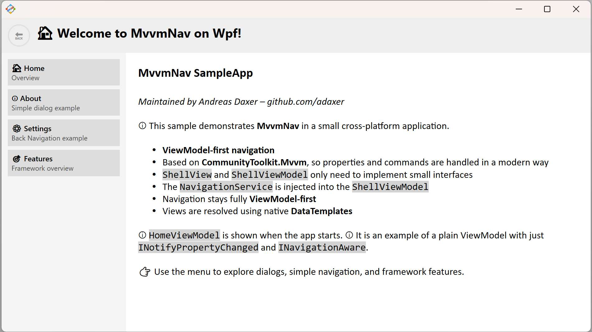
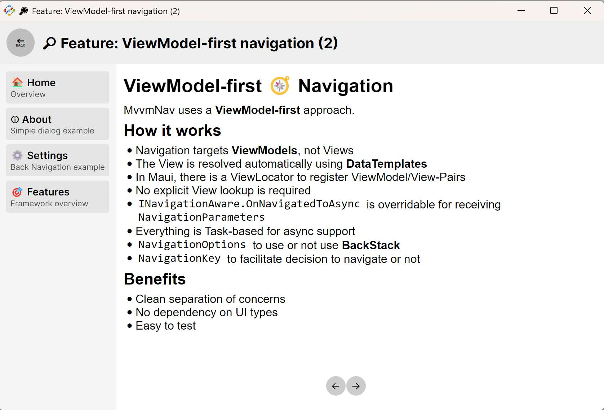
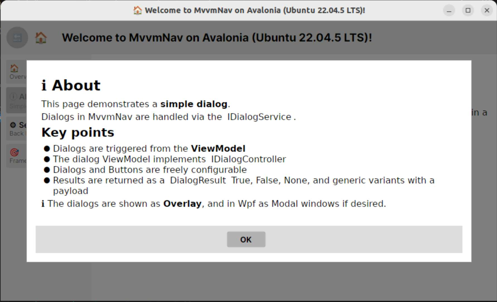
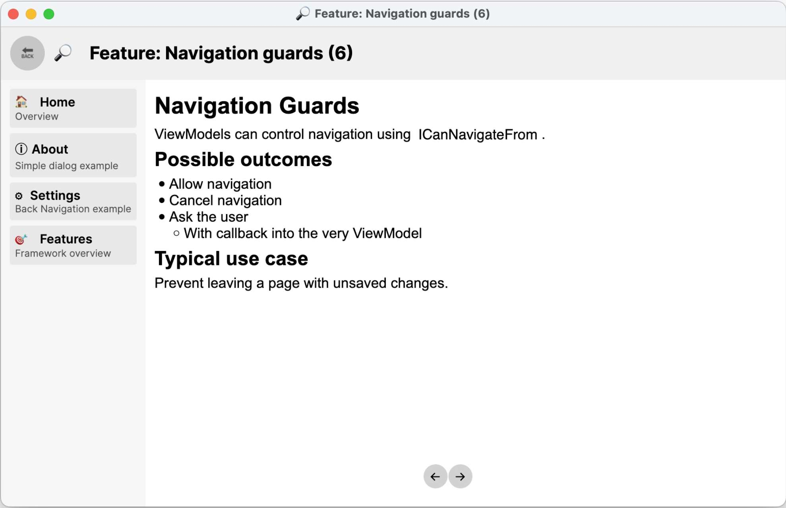
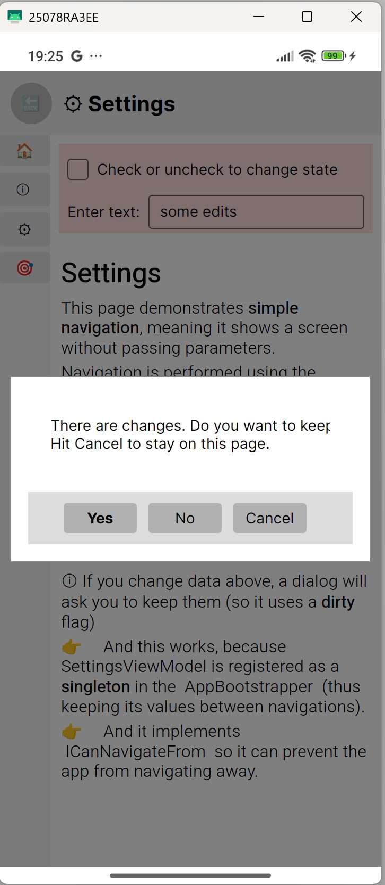
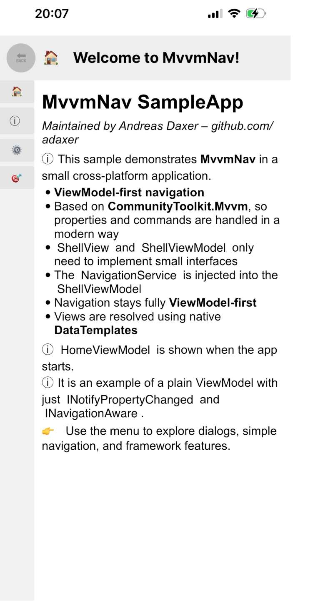
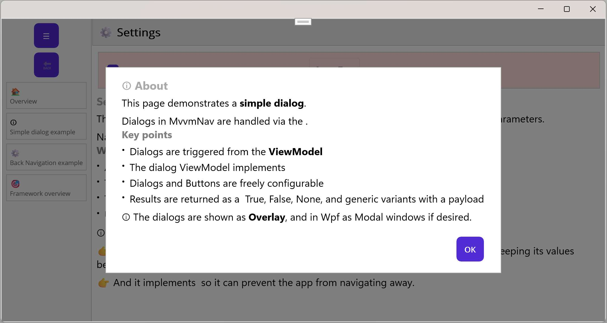
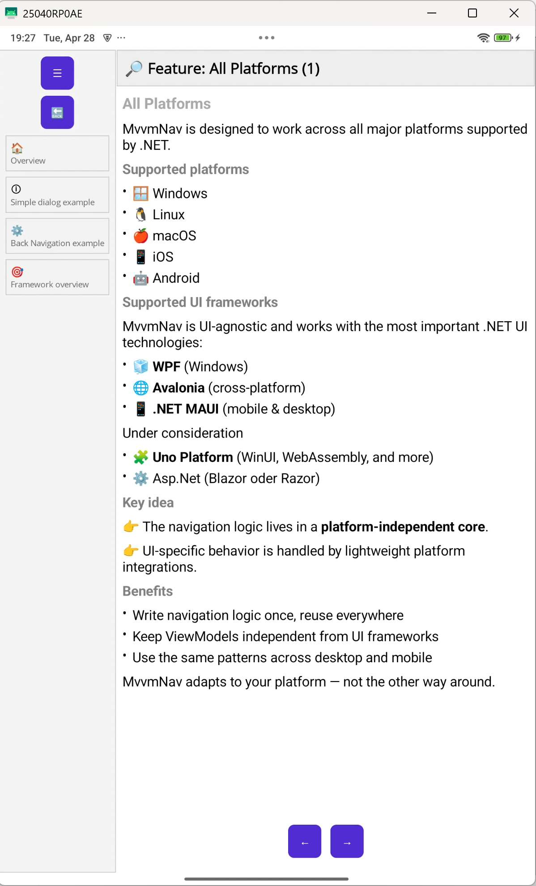

# ADaxer.MvvmNav

A lightweight, ViewModel-first navigation framework for .NET UI
applications.

Supports WPF, Avalonia and MAUI with a consistent mental model and
minimal setup.

## ✨ Why MvvmNav?

-   ViewModel-first navigation
-   Clean separation of concerns
-   Minimal infrastructure (no heavy frameworks)
-   Cross-platform core
-   Fully DI and logging compatible
-   Works with existing applications

## ❤️ Support

If this project helps you, consider supporting its development:

-   GitHub Sponsors: https://github.com/sponsors/adaxer

------------------------------------------------------------------------

## 🚀 Quick Start

Each platform provides a simple entry point:

-   WPF → `AddMvvmNavWpf(...)`
-   Avalonia → `AddMvvmNavAvalonia(...)`
-   MAUI → `AddMvvmNavMaui(...)`

You can also fully configure everything via:

``` csharp
services.AddMvvmNav(...)
```

including:

-   Dependency Injection
-   Logging (`Microsoft.Extensions.Logging`)
-   View resolution
-   Dialog behavior

------------------------------------------------------------------------

## 📸 Sample Application

The repository contains a cross-platform sample application demonstrating navigation, dialogs, and guards in real-world scenarios.

---

### 🖥️ WPF

<p align="center">
  
</p>

> Desktop sample using WPF with DataTemplate-based view resolution and fluent host builder setup.

---

### 🧩 Avalonia

<p align="center">
  
  
  
</p>

<p align="center">
  
  
</p>

> Cross-platform UI with Avalonia, sharing the same ViewModel logic across Desktop and Mobile.

---

### 📱 MAUI

<p align="center">
  
  
</p>

> Native cross-platform application using .NET MAUI with a ViewModel-first navigation approach and shell-based dialog overlays.

---
------------------------------------------------------------------------

## 🧭 Core Concepts

-   Navigation happens between **ViewModels**
-   Views are resolved by the platform
-   Navigation is handled by a central `INavigationService`
-   Dialogs are handled by `IDialogService`
-   Optional base classes, interface-first design

------------------------------------------------------------------------

## ⚙️ Configuration

Basic setup:

``` csharp
services.AddMvvmNav();
```

Or platform-specific:

``` csharp
services.AddMvvmNavWpf();
services.AddMvvmNavAvalonia();
services.AddMvvmNavMaui();
```

You can extend:

``` csharp
services.AddLogging(...);
services.AddSingleton<MyService>();
```

- Just mark your main ViewModel class with IShellViewModel and deliver properties for CurrentModule (and if wished CurrentDialog), 
- and mark your main Window/Page with the IShellView marker. 
- Inject INavigationService into your viewmodels and you are good to go. 

------------------------------------------------------------------------

# 🖥️ WPF

## Setup

``` csharp
WpfNavigationHostBuilder
    .Default()
    .WithServices(services =>
    {
        services.RegisterCommonServices();
        services.AddSingleton<IPlatformNameProvider, WpfPlatformNameProvider>();
    })
    .WithShell<ShellWindow, ShellViewModel>()
    .WithStartupNavigation<HomeViewModel>()
    .Build();

await host.StartAsync();
```


## Navigate

``` csharp
await navigation.NavigateAsync<HomeViewModel>();
```

## Dialog

``` csharp
var result = await navigation.ShowDialogAsync<AboutViewModel>();

if (result == DialogResult.True)
{
    // handle result
}
```

------------------------------------------------------------------------

# 🧩 Avalonia

## Setup

``` csharp
// In Program.cs
public static AppBuilder BuildAvaloniaApp()
{
    var services = new ServiceCollection();

    services.AddMvvmNav()
        .WithShell<ShellWindow, ShellViewModel>()
        .WithStartupNavigation<HomeViewModel>()
        .RegisterCommonServices()
        .RegisterAvaloniaSpecificServices();

    var serviceProvider = services.BuildServiceProvider();

    var result = AppBuilder.Configure<App>(()=>new App { ServiceProvider = serviceProvider })
        .UsePlatformDetect()
        .WithInterFont()
        .WithDeveloperTools()
        .LogToTrace();

    return result;
}

// In App.cs
public override async void OnFrameworkInitializationCompleted()
{
    var starter = Services.GetRequiredService<IMvvmNavStarter>();

    starter.Initialize(this);
    await starter.StartAsync();
}
```

## Navigate

``` csharp
await navigation.NavigateAsync<HomeViewModel>();
```

## Dialog

``` csharp
var result = await navigation.ShowDialogAsync<AboutViewModel>();
```

------------------------------------------------------------------------

# 📱 MAUI

## Setup

``` csharp
// In MauiProgram
builder.Services
    .AddMvvmNav()
    .WithShell<ShellPage, ShellViewModel>()
    .WithStartupNavigation<HomeViewModel>()
    .RegisterCommonServices()
    .RegisterPlatformServices();


// App.cs
public partial class App : Application
{
    private readonly IMvvmNavStarter _starter;

    public App(IMvvmNavStarter starter)
    {
        InitializeComponent();
        _starter = starter;
    }

    protected override Window CreateWindow(IActivationState? activationState)
        => _starter.CreateWindow();

    protected override async void OnStart()
        => await _starter.StartAsync();
}
```

## Navigate

``` csharp
await navigation.NavigateAsync<HomeViewModel>();
```

## Dialog

``` csharp
var result = await navigation.ShowDialogAsync<AboutViewModel>();
```

------------------------------------------------------------------------

## 🔄 Navigation with Parameters

``` csharp
await navigation.NavigateAsync<DetailsViewModel>(
    ("Id", 42),
    ("Mode", "Edit"));
```

------------------------------------------------------------------------

## 🎯 Initialize Navigation Target

ViewModels can react to navigation by implementing `INavigationAware`.

This is typically used to initialize state based on navigation parameters.

### Example

```csharp
public class DetailsViewModel : INavigationAware
{
    public int Id { get; private set; }

    public Task OnNavigatedToAsync(NavigationParameters parameters)
    {
        Id = parameters.GetValueOrDefault<int>("Id");

        // load data, initialize state, etc.
        return Task.CompletedTask;
    }
}
------------------------------------------------------------------------

## 🛑 Navigation Guards

Implement:

``` csharp
ICanNavigateFrom
```

Return:

-   Allow
-   Disallow
-   AskUser

------------------------------------------------------------------------

## 🧠 Design Goals

-   Small and understandable
-   Platform-native integration
-   No overengineering
-   Incremental evolution

------------------------------------------------------------------------

## 📦 Packages

-   ADaxer.MvvmNav.Core
-   ADaxer.MvvmNav.Wpf
-   ADaxer.MvvmNav.Avalonia
-   ADaxer.MvvmNav.Maui

------------------------------------------------------------------------

## 🧪 Sample App Features

-   Navigation & back stack
-   Dialog handling
-   Navigation guards (save/discard)
-   Markdown-based help pages
-   Cross-platform shell

------------------------------------------------------------------------

## 🛠️ Status

Actively developed.

API is stabilizing toward v1.

------------------------------------------------------------------------

## 📄 License

Apache License 2.0


------------------------------------------------------------------------
